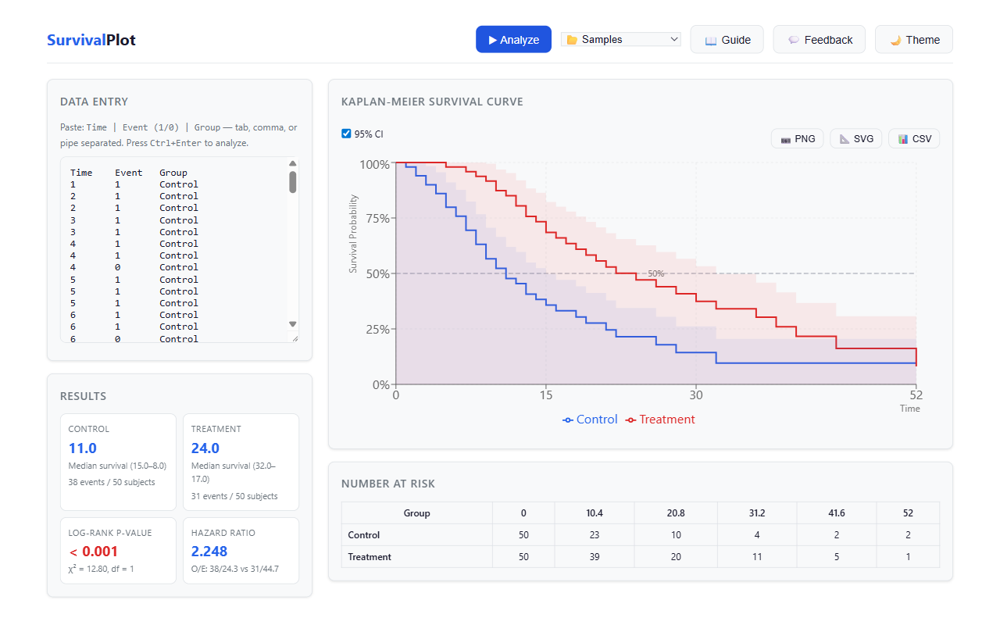

# SurvivalPlot

**Free, publication-quality Kaplan-Meier survival analysis in the browser.**

Replace GraphPad Prism and SPSS survival workflows with an open-source web tool that generates KM curves, log-rank tests, and at-risk tables — no install required.

 <!-- TODO: add screenshot -->

---

## Features

- **Kaplan-Meier Curves** — step-function survival plots with censoring tick marks, one curve per group
- **95 % Confidence Intervals** — Greenwood's formula with optional shaded bands
- **Log-Rank Test** — chi-square statistic, p-value, and hazard ratio for two-group comparison
- **Median Survival** — per-group median with 95 % CI (Brookmeyer-Crowley)
- **At-Risk Table** — standard number-at-risk display aligned below the plot
- **Data Entry** — paste or upload CSV (Subject | Time | Event | Group)
- **Export** — download chart as PNG/SVG and results table as CSV
- **Light / Dark Theme** — toggle between light and dark modes

---

## Quick Start

```bash
# Prerequisites: Node ≥ 18, pnpm
pnpm install
pnpm dev          # → http://localhost:5173
```

Paste time-to-event data into the editor, click **Analyze**, and view your KM plot instantly.

### Run Tests

```bash
pnpm test
```

### Production Build

```bash
pnpm build
```

---

## Key Equations

### Kaplan-Meier Estimator

$$S(t) = \prod_{t_i \leq t} \left(1 - \frac{d_i}{n_i}\right)$$

where *d_i* = events at time *t_i*, *n_i* = subjects at risk just before *t_i*.

### Greenwood's Variance

$$\text{Var}\!\bigl(S(t)\bigr) = S(t)^{2} \sum_{t_i \leq t} \frac{d_i}{n_i\,(n_i - d_i)}$$

95 % CI: $S(t) \pm 1.96\,\sqrt{\text{Var}(S(t))}$, clamped to [0, 1].

### Log-Rank Test

$$\chi^{2} = \sum_{j} \frac{(O_j - E_j)^{2}}{E_j}, \quad \text{df} = 1$$

where $E_j = \frac{n_j}{n} \cdot d$ at each distinct event time.

---

## Tech Stack

| Layer | Technology |
|-------|------------|
| Engine | TypeScript (pure, zero-dependency) |
| Web UI | React 18 + Vite |
| Charting | Recharts |
| Monorepo | pnpm workspaces |
| Testing | Vitest |

---

## Project Structure

```
survivalplot/
├── packages/
│   ├── engine/           # Pure-TS survival analysis library
│   │   └── src/
│   │       ├── parser.ts       # CSV / paste data parser
│   │       ├── estimator.ts    # Kaplan-Meier estimator + CI
│   │       ├── logrank.ts      # Log-rank test + hazard ratio
│   │       ├── atrisk.ts       # At-risk table generator
│   │       ├── types.ts        # Observation, KMStep, KMResult, …
│   │       └── __tests__/      # Unit tests
│   └── web/              # React front-end
│       └── src/
│           ├── App.tsx
│           └── components/
│               ├── DataEntry.tsx
│               ├── KMChart.tsx
│               ├── ResultsPanel.tsx
│               └── AtRiskTable.tsx
├── PLAN.md
├── pnpm-workspace.yaml
└── package.json
```

---

## License

MIT
